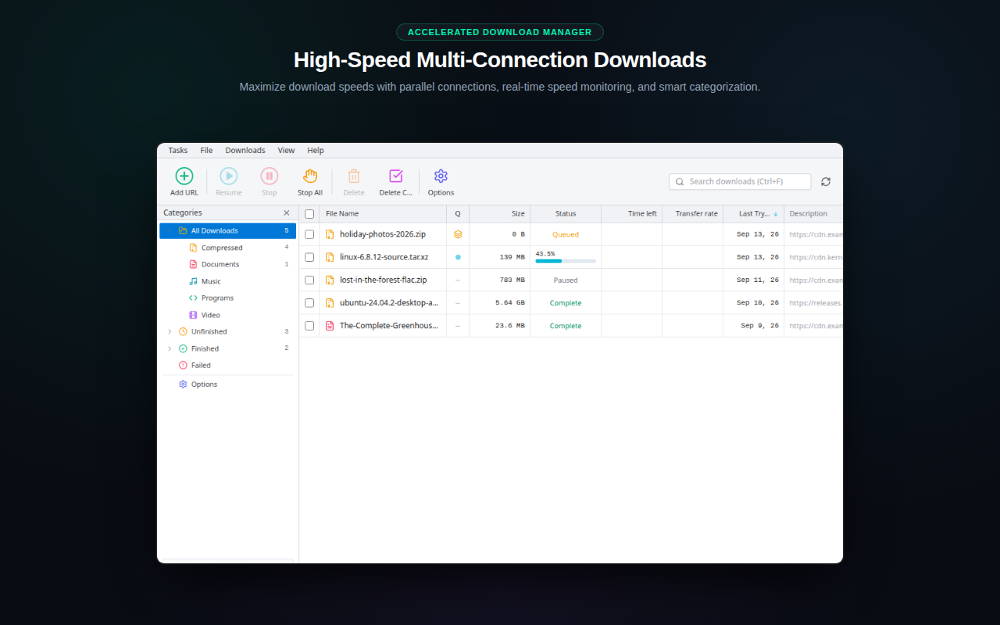
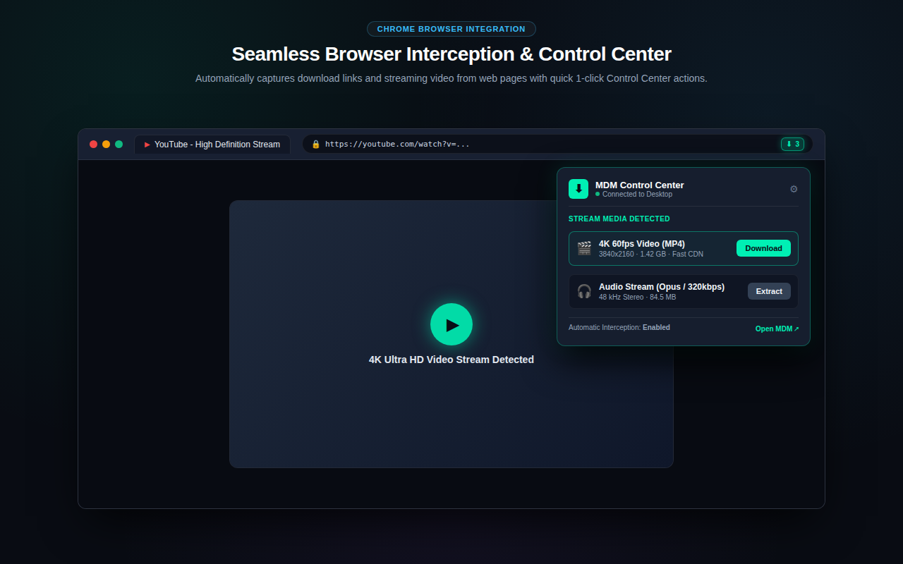
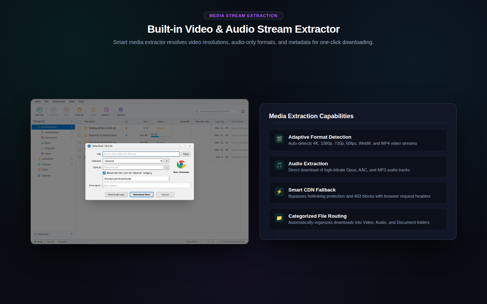
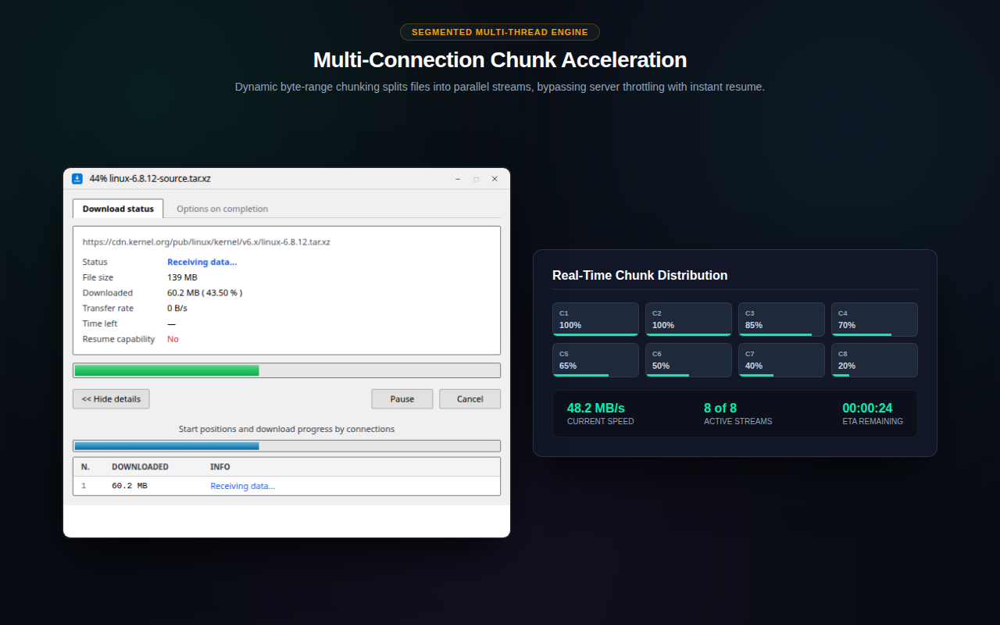
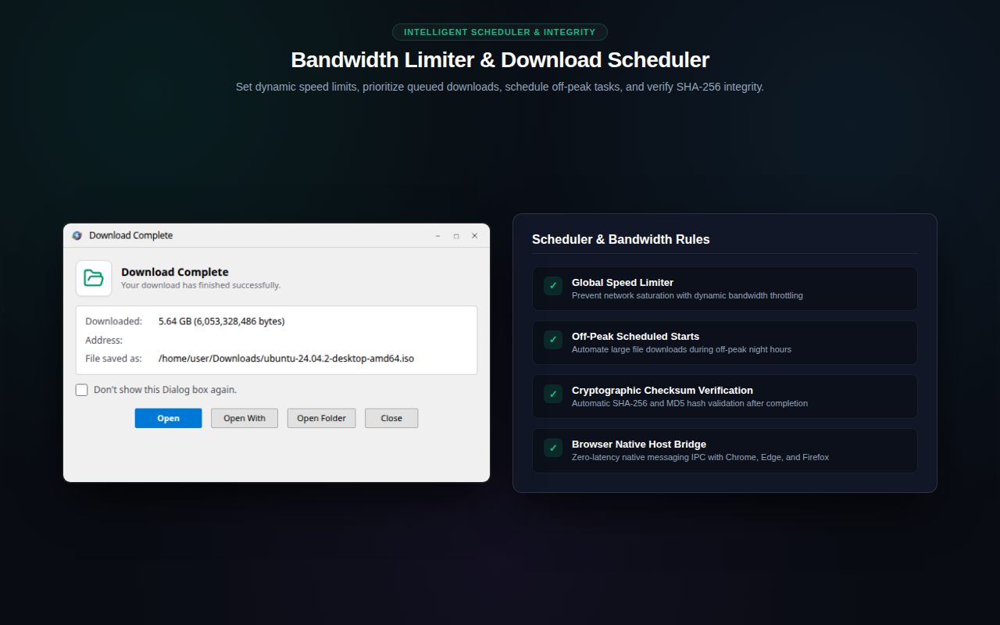

<div align="center">


# MDM Download Manager

**A fast, reliable, local-first, open-source download manager built with Rust, Tokio, SQLite, Tauri 2, React, and TypeScript.**

[](https://marthdownloadmanager.msdevx.com)
[](https://github.com/MS-DevX/MDM/actions/workflows/ci.yml)
[](LICENSE)
[](https://www.rust-lang.org/)
[](#-installation)

</div>

---

## ✨ Features

- **Local-first & zero bloat** — No remote cloud accounts, zero telemetry, zero analytics, zero ads. Your downloads and history stay on your machine (SQLite database).
- **Smart Link Classification & Media Routing** — Automatically inspects links to distinguish direct files from web media pages (e.g. YouTube, Vimeo), selecting the optimal download engine without manual configuration.
- **Multi-connection acceleration** — Splits downloads into parallel ranged chunks and reassembles them with integrity verification for faster, resilient transfers.
- **Durable persistence** — SQLx + SQLite with embedded migrations, WAL mode, foreign keys, and atomic state transitions. Downloads survive crashes and restarts, and recover from disk state.
- **Reliable by design** — Automatic retries, pause/resume, cancellation, restart recovery, and a supervised worker/scheduler architecture that isolates failures.
- **Multiple interfaces**:
  - **CLI (`mdm`)** — A high-performance terminal interface.
  - **Desktop app** — A Tauri 2 + React + TypeScript + Tailwind CSS GUI.
  - **Browser extension** — A Manifest V3 extension with context-menu capture, page link scraping, and native messaging integration.
- **Real-time event bus** — Tokio broadcast channels push instant progress and status updates to every connected frontend.

- **Windowed desktop UX** — New-download wizard, floating per-download progress windows, and a Download Complete dialog with Open / Show-in-folder actions, completion sound, and per-download preferences.
- **Guided browser integration** — The extension has a **deterministic extension ID** (committed manifest key), so the native messaging host can be registered *before* the extension is loaded. Installers auto-register it (stable `com.mdm.native_host` with deterministic origins); Settings → **D. Browser Integration** or `mdm browser-extension install` completes one-shot setup for Chrome, Edge, Chromium, Brave, and Firefox.

---

## 📸 Screenshots

| High-Speed Downloads Dashboard | Browser Integration & Control Center |
|:---:|:---:|
|  |  |

| Media Stream Extractor | Parallel Chunk Acceleration | Smart Queue & Scheduler |
|:---:|:---:|:---:|
|  |  |  |

---

## 🆕 What's New

Recent highlights (v0.1.x):

- **Deterministic browser-extension ID** — the extension's stable ID (`jlhjhpchnlpgbgdcaniadhapcldphhae`) is derived from a committed manifest key, so native host manifests can be registered with the correct `allowed_origins`/`allowed_extensions` before the extension is even installed.
- **Guided one-shot browser setup** — `install.sh` / `install.ps1` optionally auto-register the native messaging host for all supported browsers (`MDM_BROWSER_SETUP=auto`, interactive prompt by default). The desktop **Settings → D. Browser Integration** card and the new `mdm browser-extension install` CLI command offer the same flow.
- **Cross-platform validation in CI** — rustfmt, clippy (`-D warnings`) across the whole workspace, the architectural boundary audit (71 checks), plus full Rust/TypeScript/Playwright/native-IPC test suites.

---

## 📥 Installation

Choose your preferred way to install MDM Download Manager:

1. [**🖥️ Download (Direct GUI Installers)**](#-download-direct-gui-installers) — Recommended for desktop users who prefer point-and-click installers.
2. [**⚡ Quick Install (Terminal CLI)**](#-quick-install-terminal-cli) — One-line command for developers and automated workflows.

---

### 🖥️ Download (Direct GUI Installers)

Ready-to-run desktop application installers are published on every [GitHub Release](https://github.com/MS-DevX/mdm-releases/releases/latest). Click to download:

| Operating System | Architecture | Direct Download Artifact | Type & Format |
|:---|:---|:---|:---|
| 🪟 **Windows** | x64 (64-bit) | [**⬇️ MDM-windows-x64.exe**](https://github.com/MS-DevX/mdm-releases/releases/latest/download/MDM-0.1.0-windows-x64.exe) | NSIS Installer (Win 10/11) |
| 🐧 **Linux** | x64 (64-bit) | [**⬇️ MDM-linux-x64.AppImage**](https://github.com/MS-DevX/mdm-releases/releases/latest/download/MDM-0.1.0-linux-x64.AppImage) | Standalone AppImage (`chmod +x`) |
| 🍎 **macOS** | Apple Silicon (M1/M2/M3/M4) | [**⬇️ MDM-macos-arm64.dmg**](https://github.com/MS-DevX/mdm-releases/releases/latest/download/MDM-0.1.0-macos-arm64.dmg) | Drag-and-drop `.dmg` |

> **Supported release matrix:** Desktop GUI installers are published for Linux x64 (AppImage), Windows x64 (NSIS), and macOS Apple Silicon (ARM64). ARM64 Windows, Intel macOS, and `.deb` packages are on the [roadmap](#-roadmap) and are not yet published.

> 🔒 **Cryptographic Verification:** Every release includes a [`checksums.txt`](https://github.com/MS-DevX/mdm-releases/releases/latest/download/checksums.txt) file (mirrored as `SHA256SUMS`) containing SHA-256 digests for all packaged artifacts.

> 💡 These **direct** links always point at the latest release's artifacts. The installer downloads (below) stream the same verified binaries through the `install.sh` / `install.ps1` scripts.

---

### ⚡ Quick Install (Terminal CLI)

Install the standalone MDM Command-Line Interface (`mdm`) with a single command:

#### macOS / Linux

```bash
# Using official domain
curl -fsSL https://marthdownloadmanager.msdevx.space/install | bash

# Or directly from the public releases repository
curl -fsSL https://raw.githubusercontent.com/MS-DevX/mdm-releases/main/install.sh | bash
```

*Installs to `~/.local/bin/mdm` without requiring `sudo`, verifies SHA-256 cryptographic checksums, and updates your shell PATH (`.bashrc` / `.zshrc`).*

#### Windows PowerShell

```powershell
# Using official domain
irm https://marthdownloadmanager.msdevx.space/install.ps1 | iex

# Or directly from the public releases repository
powershell -ep Bypass -c "irm https://raw.githubusercontent.com/MS-DevX/mdm-releases/main/install.ps1 | iex"
```

*Installs to `$env:LOCALAPPDATA\mdm\bin\mdm.exe`, verifies SHA-256 cryptographic checksums, and configures the user PATH.*

---

### Supported Platforms & Architectures

| OS | Architecture | Desktop GUI | CLI (`mdm`) | Release Formats |
|:---|:---|:---:|:---:|:---|
| **Windows** | x64 / amd64 | ✅ | ✅ | `.exe` (NSIS), `mdm-windows-x64.exe` |
| **Linux** | x64 / amd64 | ✅ | ✅ | `.AppImage`, `mdm-linux-x64` |
| **Linux** | ARM64 / aarch64 | 🔨 *Roadmap* | ✅ | Standalone CLI (`mdm-linux-arm64`) |
| **macOS** | Apple Silicon (arm64) | ✅ | ✅ | `.dmg`, `mdm-macos-arm64` |

---

### Manual CLI Installation

If you prefer to download standalone CLI executables directly:

1. Download your platform's binary from [GitHub Releases](https://github.com/MS-DevX/mdm-releases/releases):
   - Linux x64: `mdm-linux-x64`
   - Linux ARM64: `mdm-linux-arm64`
   - macOS ARM64: `mdm-macos-arm64`
   - Windows x64: `mdm-windows-x64.exe`
2. Download `checksums.txt`.
3. Verify integrity:
   ```bash
   sha256sum -c checksums.txt --ignore-missing
   ```
4. Move the executable to your `PATH` and mark it executable:
   ```bash
   # Linux & macOS
   chmod +x mdm-<platform>-<arch>
   mv mdm-<platform>-<arch> ~/.local/bin/mdm
   ```

---

### Upgrading

To upgrade to the latest stable release, simply re-run the one-line installation command. The installer will safely overwrite the existing binary with the verified new version:

```bash
# Linux / macOS
curl -fsSL https://raw.githubusercontent.com/MS-DevX/mdm-releases/main/install.sh | bash

# Windows PowerShell
powershell -ep Bypass -c "irm https://raw.githubusercontent.com/MS-DevX/mdm-releases/main/install.ps1 | iex"
```

To install a specific version, set `MDM_VERSION`:

```bash
# Linux / macOS
export MDM_VERSION=v0.1.0 && curl -fsSL https://raw.githubusercontent.com/MS-DevX/mdm-releases/main/install.sh | bash

# Windows PowerShell
$env:MDM_VERSION="v0.1.0"; powershell -ep Bypass -c "irm https://raw.githubusercontent.com/MS-DevX/mdm-releases/main/install.ps1 | iex"
```

---

### Uninstalling

#### Linux / macOS
```bash
rm -f ~/.local/bin/mdm
```
*(Optionally remove `export PATH="$HOME/.local/bin:$PATH"` from your `~/.bashrc` or `~/.zshrc`).*

#### Windows PowerShell
```powershell
Remove-Item -Recurse -Force "$env:LOCALAPPDATA\mdm"
```

---

### Security & Integrity

- **Strict HTTPS:** All downloads are served exclusively over encrypted TLS connections.
- **Fail-Closed Verification:** Binaries are verified against official release SHA-256 digests before execution or placement into your `PATH`. If a checksum fails, installation terminates immediately and discards temporary files.
- **Least Privilege:** Installers operate completely in user-space (`~/.local/bin` on POSIX and `$env:LOCALAPPDATA` on Windows) and never require `sudo` or Administrator privileges.

---

## 🚀 Usage

### CLI

```bash
# Add a new download (8 parallel connections)
mdm add https://example.com/file.zip --connections 8

# List downloads
mdm list

# Check download status
mdm status <download-id>

# Pause, resume, or cancel
mdm pause <download-id>
mdm resume <download-id>
mdm cancel <download-id>

# Manage the download queue
mdm queue

# Schedule
mdm schedule

# Inspect configuration
mdm config

# Register the native messaging host for your browser
# (uses the stable extension ID automatically)
mdm register-browser-host

# Guided one-click browser setup: copy the extension + register the host
mdm browser-extension install
```

Run `mdm --help` for the full command reference.

### Desktop app

The Tauri desktop application provides a graphical interface with live progress, queue management, pause/resume/cancel, and seamless integration with the Rust engine.

### Browser extension

MDM's browser extension uses a **deterministic extension ID** (`jlhjhpchnlpgbgdcaniadhapcldphhae`, fixed by the committed manifest key), so the native messaging host can be registered before the extension is even loaded:

- **In-app**: open Settings → **D. Browser Integration**, pick a browser, click **Install**.
- **CLI**: `mdm browser-extension install` copies the built extension and registers the host in one step.
- **Installers**: answer **Y** to the "Set up browser integration now?" prompt (or `MDM_BROWSER_SETUP=auto`).

Chrome, Microsoft Edge, Chromium, Brave, and Firefox are supported. The extension adds a context-menu "Download with MDM" action and page link scraping.

#### Manual installation guide

Browsers forbid *silently* installing unpacked extensions, so the final browser step is always manual:

1. **Make the extension available** — the installers and `mdm browser-extension install` place the built extension at `~/.local/share/mdm/browser-extension`. Building from source? `npm run build:extension` outputs the identical package to `apps/browser-extension/dist` (point the browser there instead).
2. **Register the native messaging host (once)** — `mdm browser-extension install` handles this for you; alternatively run `mdm register-browser-host`. Because the extension ID is deterministic, the host manifest already carries the correct `allowed_origins` / `allowed_extensions` — no ID copy-pasting.
3. **Load the unpacked extension** in your browser of choice:

| Browser | Extensions page | Steps |
|:---|:---|:---|
| **Chrome** / **Chromium** | `chrome://extensions` | Toggle **Developer mode** (top-right) → **Load unpacked** → select `~/.local/share/mdm/browser-extension`. |
| **Microsoft Edge** | `edge://extensions` | Toggle **Developer mode** → **Load unpacked** → select the same folder. |
| **Brave** | `brave://extensions` | Toggle **Developer mode** → **Load unpacked** → select the same folder. |
| **Firefox** | `about:debugging#/runtime/this-firefox` | Click **Load Temporary Add-on…** → select the `manifest.json` inside `~/.local/share/mdm/browser-extension`. *(Temporary add-ons are removed on restart; a persistent install requires a signed add-on once published to AMO.)* |

4. **Verify** — right-click any page and confirm **Download with MDM** appears; triggered downloads hand off to the MDM desktop app / CLI.

> Store publishing is planned and will replace the manual **Load unpacked** step with true one-click, silent installs (and enterprise policy force-install for managed devices).

---

## 🔨 Building from Source

### Prerequisites

- **Rust**: stable (1.75+), e.g. `rustup default stable`
- **Node.js**: 20+ and `npm` (the CI pipeline currently targets Node.js 24 LTS)
- **Linux only**: Tauri/GTK system libraries (`libwebkit2gtk-4.1-dev`, `libgtk-3-dev`, `librsvg2-dev`, `patchelf`, `file`)

### Clone, build & test

```bash
git clone https://github.com/MS-DevX/MDM.git
cd MDM

# Install frontend dependencies
npm install

# Run all Rust workspace tests
cargo test --workspace

# Run the CLI tool
cargo run --bin mdm -- --help
```

### Frontend & desktop development

```bash
# Run the desktop React frontend in dev mode
npm run dev:desktop

# Typecheck both frontends
npm run typecheck

# Build the desktop frontend
npm run build:desktop

# Build the browser extension (dist/ folder)
npm run build:extension
```

---

## 🧪 Testing & Validation

MDM ships a layered verification suite that runs in CI:

```bash
# 1. Core Rust engine & CLI suites (931 tests)
cargo test --workspace

# 2. Desktop authority & contract tests (389)
npm test --prefix apps/desktop

# 3. Browser extension manifest & contract tests (131)
npm test --prefix apps/browser-extension

# 4. Deterministic desktop DOM E2E (17 Playwright scenarios)
npm run test:e2e

# 5. Native WebExtension ↔ Native Host ↔ Desktop IPC (31 tests)
npm run test:integration

# 6. Native desktop webview smoke harness (7 scenarios, requires GUI)
npm run test:e2e:native

# 7. Architectural boundary audit (71 checks, 0 violations)
bash scripts/check_application_boundary.sh
```

Also enforced in CI: `cargo fmt --all --check`, `cargo clippy -p mdm-engine -p mdm-cli --all-targets -- -D warnings`, `cargo clippy -p mdm-desktop --all-targets -- -D warnings`, and `npm run lint`.

---

## 🏗️ Architecture

```
.
├── Cargo.toml                  # Cargo workspace manifest
├── package.json                # Root npm workspace manifest
├── crates/
│   ├── engine/                 # Core download engine (Rust + Tokio + SQLx + SQLite)
│   │   ├── migrations/         # Embedded SQLite migrations
│   │   ├── src/                # Domain models, repositories, injection
│   │   └── tests/              # In-memory SQLite integration tests
│   └── cli/                    # Clap CLI (`mdm`) + native messaging host
└── apps/
    ├── desktop/                # Tauri 2 + React + TypeScript + Tailwind GUI
    │   └── src-tauri/          # Tauri 2 Rust integration crate
    └── browser-extension/      # TypeScript WebExtension (Manifest V3)
```

The Rust core engine is completely isolated and decoupled from any presentation layer, so the exact same engine powers the CLI, the desktop GUI, and the browser extension.

---

## 🛣️ Roadmap

Planned and in-progress work includes:

- **Auto-updater** — The Tauri updater is configured but its deployment (hosting + signing keys) is pending.
- **Broader platform coverage** — Intel macOS, Linux arm64, and other targets.

---

## 🤝 Contributing

Contributions are welcome! Please read [CONTRIBUTING.md](CONTRIBUTING.md) for the build/test workflow, coding conventions, and PR checklist.

This project is governed by our [Code of Conduct](CODE_OF_CONDUCT.md). By participating, you agree to uphold it.

- Found a bug? [Open an issue](https://github.com/MS-DevX/mdm-releases/issues).
- Have an idea? [Open a feature request](https://github.com/MS-DevX/mdm-releases/issues).
- Ready to code? Fork the repo and open a pull request.

---

## 📄 License

Licensed under the [Apache License, Version 2.0](LICENSE).

---

<div align="center">

**Made with ❤️ and Rust.** If MDM is useful to you, consider starring the repo and sharing it.

</div>
